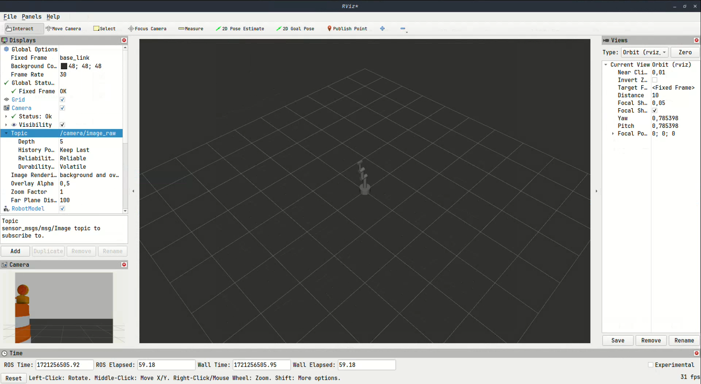

# 3dof
3dof es un brazo robótico articulado con 3 grados de libertad con una cámara adjuntada en el extremo del brazo. En este repositorio se mostrará la simulación de este brazo en Rviz, con ventana de controles, y en Gazebo, siendo controlado por comandos.
Todos los archivos personalizados se encuentran comentados para el entendimiento del usuario.
Este trabajo fue realizado en ROS2 Iron.

## Setup
Para lograr ejecutar el programa se deben cambiar algunas dirección de archivos con respecto donde se ubique el repositorio. 
- En el archivo src/3dof/launch/gazebo.launch.py en la linea 10 se debe cambiar la dirección por ``(dirección de repositorio)/src/3dof/urdf/robot.xacro``. También se debe cambiar la dirección en la linea 28 por ``(dirección de repositorio)/src/3dof/world/obstacule.world``
- En el archivo src/3dof/launch/visualization.launch.py en la linea 7 se debe cambiar la dirección por ``(dirección de repositorio)/src/3dof/urdf/robot.urdf``. También se debe cambiar la dirección en la linea 29 por ``(dirección de repositorio)/src/3dof/config/config.rviz``
- En el archivo src/3dof/urdf/control.xacro en la linea 43 se debe cambiar la dirección por ``(dirección de repositorio)/src/3dof/config/joint_controller.yaml``
- En el archivo src/3dof/urdf/robot.urdf en la linea 42 se debe cambiar la dirección por ``(dirección de repositorio)/src/3dof/config/joint_controller.yaml``

Se deben instalar las siguientes dependencias:
- ``sudo apt install ros-iron-gazebo-ros-pkgs``
- ``sudo apt install ros-iron-ros2-control``
- ``sudo apt install ros-iron-ros2-controllers``
- ``sudo apt install ros-iron-gazebo-ros2-control``

## Simulación en Rviz
Para simularlo en Rviz se debe ubicar en la carpeta donde se haya clonado el repositorio. Luego se ejecutan los siguientes comandos:

Inicializar ROS.

``source /opt/ros/iron/setup.bash``

Se instala el paquete 3dof.

``colcon build``

``source install/setup.bash``

Se inicia la simulación en Rviz.

``ros2 launch 3dof visualization.launch.py``

El video de demostración se encuentra en [este archivo descargable](images/video/Rviz.webm)

## Simulación en Gazebo
Para simularlo en Rviz se debe ubicar en la carpeta donde se haya clonado el repositorio. Luego se ejecutan los siguientes comandos:

Inicializar ROS.

``source /opt/ros/iron/setup.bash``

Se instala el paquete 3dof.

``colcon build``

``source install/setup.bash``

Se inicia la simulación en Gazebo.

``ros2 launch 3dof gazebo.launch.py``

El video de demostración se encuentra en [este archivo descargable](images/video/gazebo.webm)

