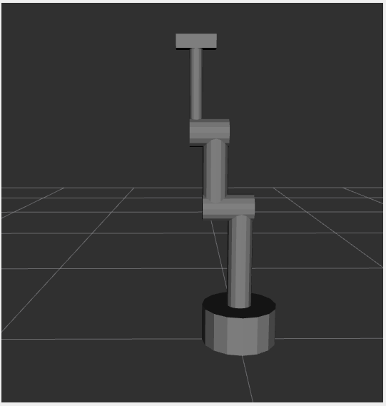
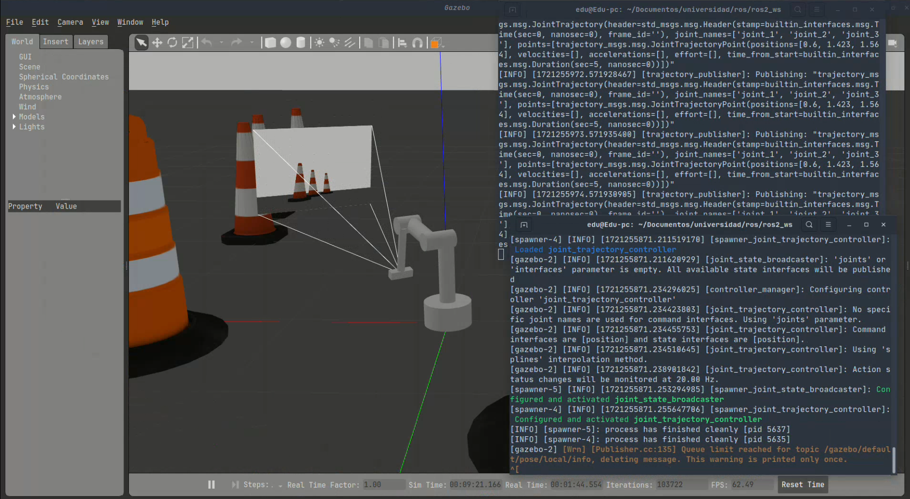

# 3dof
3dof es un brazo robótico articulado con 3 grados de libertad con una cámara adjuntada en el extremo del brazo. En este repositorio se mostrará la simulación de este brazo en Rviz, con ventana de controles, y en Gazebo, siendo controlado por comandos.
Todos los archivos personalizados se encuentran comentados para el entendimiento del usuario.
Este trabajo fue realizado en ROS2 Iron.

## Setup
Cambiar algunos caminos
se instala ros2, ros2 gazebo
sudo apt install ros-iron-ros2-control ros-iron-ros2-controllers ros-iron-gazebo-ros2-control
## Simulación en Rviz
Para simularlo en Rviz se debe ubicar en la carpeta donde se haya clonado el repositorio. Luego se ejecutan los siguientes comandos:

Inicializar ROS.
``source /opt/ros/iron/setup.bash``

Se instala el paquete 3dof.
``colcon build``
``source install/setup.bash``

Se inicia la simulación en Rviz.
``ros2 launch 3dof visualization.launch.py``

## Simulación en Gazebo
Para simularlo en Rviz se debe ubicar en la carpeta donde se haya clonado el repositorio. Luego se ejecutan los siguientes comandos:

Inicializar ROS.
``source /opt/ros/iron/setup.bash``

Se instala el paquete 3dof.
``colcon build``
``source install/setup.bash``

Se inicia la simulación en Gazebo.
``ros2 launch 3dof gazebo.launch.py``

